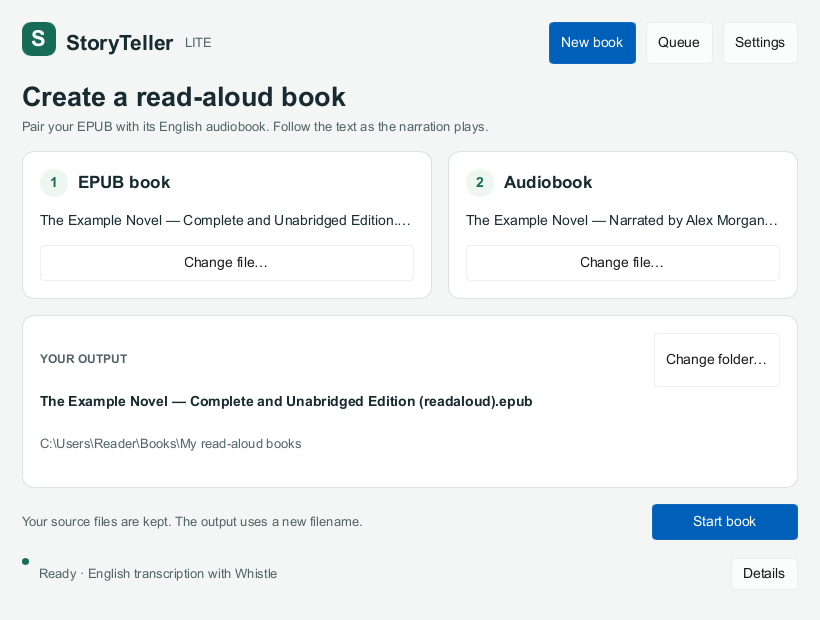
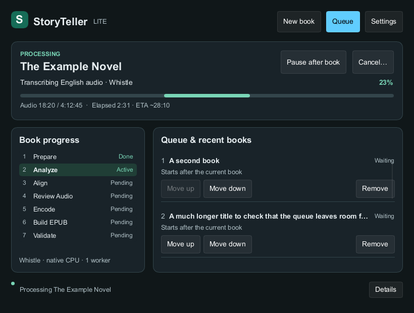
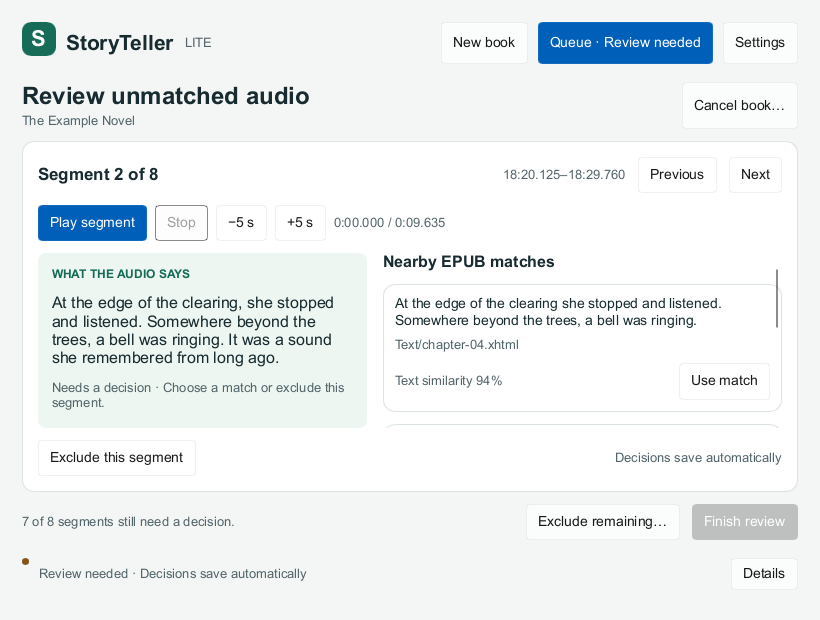
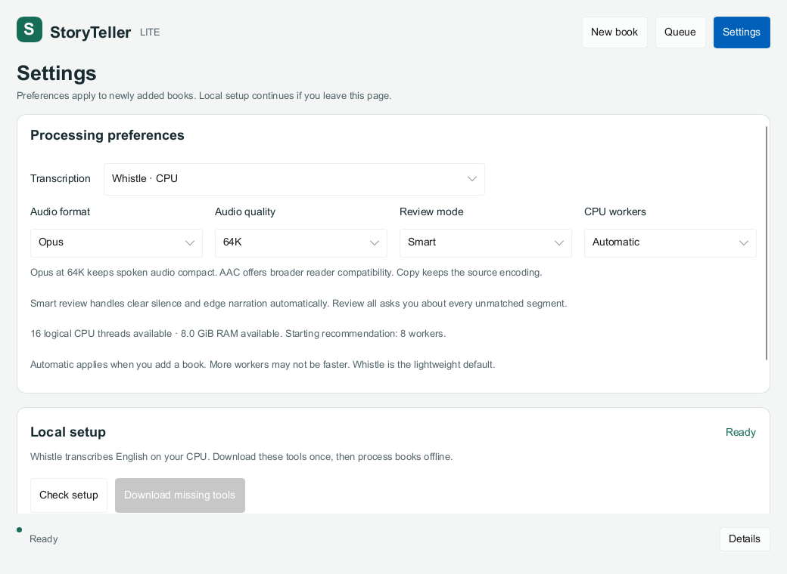
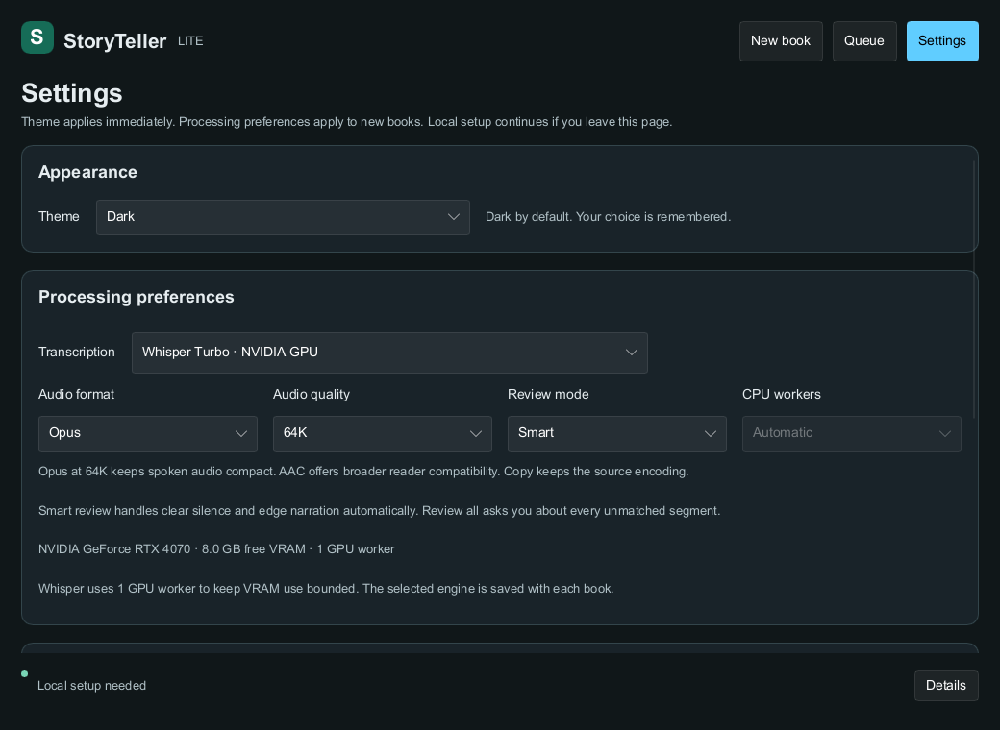
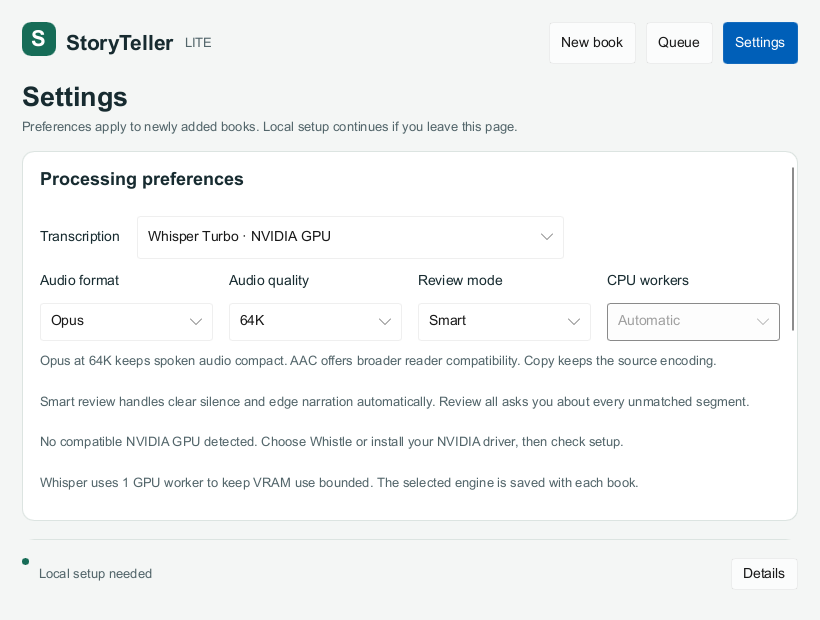

# Native UI rebuild

StoryTeller Lite uses one native Rust + Slint window, with New book, Queue and Settings workspaces. Whistle is the default; Settings also offers optional English transcription with Whisper Turbo on NVIDIA GPUs.

The default appearance is **Dark**, regardless of the system theme. Settings → Appearance → Theme offers Dark and Light; selection updates both custom surfaces/text and native buttons, menus, selectors and scrollbars immediately. The choice is saved in the application's `appearance.json` and restored before the window opens. Missing or unreadable preferences use Dark. Appearance is separate from job settings and never changes queued books or cached processing.

## Book creation

Choose an EPUB and its matching audiobook with keyboard-accessible native buttons. The output filename and folder appear before starting. Change folder selects a destination without changing either source. Existing outputs are preserved: a new book cannot start with an occupied destination.

The app scans local tools in the background on startup. Start book requires both sources and ready tools. Local setup takes you to Settings for user-initiated verified downloads. While another book is active, the same action adds a waiting book. Successful submission opens Queue and clears the source selection.

Processing preferences are in Settings rather than repeated beside every book. Defaults are Opus/64K, Smart review, English and Automatic CPU workers. Startup and Check setup scan available logical CPU threads and RAM on the computer running the app, alongside runtime discovery. Settings displays the detected resources and a starting worker recommendation. Manual counts of 1–16 override it. Automatic resolves to a concrete count when a book is queued; saved and recovered books keep that count. Preferences apply to newly queued books.

Whistle transcription uses the pinned CPU engine. Selecting Whisper shows separate CUDA engine/model readiness and detected free VRAM; its CPU-worker selector is disabled because GPU jobs use one worker. Downloads are explicit and unavailable when hardware setup is insufficient. Backend preferences apply only to newly queued books; each waiting row displays its saved engine/worker count, and Resume queue checks the next book's saved backend. The recommendation leaves CPU/RAM headroom and is a heuristic, not a measured fastest setting. If CPU or RAM information is unavailable, Automatic falls back to one worker. [RUNTIME.md](RUNTIME.md) records the policy and its limits.

## Processing and queue

The active card shows actual progress, current activity, processed audio and available timing. All seven stage labels have a stable vertical order. No estimated transcription progress is fabricated. The adjacent list shows waiting books followed by the three latest outcomes, with reorder, retry, remove and Open output folder actions when applicable.

Pause after book allows the current book to finish. Resume queue continues paused work. Cancel first explains the consequences; the final command identifies the displayed book, so an old confirmation cannot cancel a newly active book. Removing a queue row does not delete its source or output.

## Audio review

Review opens on Queue when a book needs decisions. Playback, previous/next and seek controls remain above the scrollable content; exclusion and completion actions remain below it. The transcript and nearby EPUB matches have separate scroll areas so a long passage does not bury the first available match.

Text similarity is a lexical-overlap score, not a probability that the match is correct. Review preserves existing text/image assignment, introduction/credits preservation and per-segment exclusion. Decisions save immediately and advance to the first undecided segment. Finish review remains disabled until the durable report is complete. Exclude remaining requires a second click explaining that excluded audio has no synchronized text.

An application-owned worker loads review reports and caches alignment/corpus evidence per book. A single cancellable request stream coalesces navigation; generation and job identity checks discard stale results. Seeking uses the cached selected segment. Candidate loading and file/ZIP reads no longer run on the UI thread. Evidence failures remain visible and do not silently complete a review. Reload review can recover a repaired report.

Audio preview has a separate application-owned worker. It owns one ffplay child, detects natural exit and handles process spawn, kill and wait off the UI thread. Changing segments, saving a decision, leaving review, cancellation and shutdown stop preview. Missing ffplay leaves manual decisions available and displays a useful error.

## Visual and interaction validation

The minimum content size is 820×620; the default is 1040×760. Settings, long queues, long review text and status details scroll locally. Navigation stays available during dependency setup.

The shared fixtures in [tools/ui/fixtures.json](../tools/ui/fixtures.json) cover empty setup, missing tools, selected long filenames, processing, cancellation, paused recovery, completed/failed books, error details, pending/completed/loading review, bulk exclusion and ready/missing Settings.

Run the actual compiled Slint scenes without a desktop session:

```text
cargo run --locked -p storyteller-ui --example ui_snapshot -- tools/ui/fixtures.json ui-snapshots
```

The harness uses Slint 1.17.1's software renderer to capture 96 PPM images: sixteen scenes in both Dark and Light at 820×620 and 1040×760, plus compact scenes at 200% scale. It dispatches real pointer and keyboard events in both themes to check source selection, start guards, workspace navigation, review completion and the two-click bulk exclusion path. Additional native checks select Light/Dark by keyboard, verify immediate canvas changes and reload the saved choices in fresh windows. Scene fixtures have no processing/download/file-dialog callbacks.

Windows checkpoint [37211560379](https://github.com/skypie0102/storyteller-lite/actions/runs/37211560379) on source commit `8fb11d4e0172541e7818c5c46fde5731f129aa5d` passed strict locked workspace Clippy, all 183 workspace tests, the native Slint build, all 48 scene renders, pointer/keyboard checks at both normal sizes, native Whistle/Turbo adapter checks and packaged relaunch recovery. Its only failure was formatting in one controller test. A formatting-only correction passed [formatting run 37215449790](https://github.com/skypie0102/storyteller-lite/actions/runs/37215449790); UI source is unchanged between these runs. [REBUILD.md](REBUILD.md) records the complete evidence and hardware limits.

The merged Whistle [worker checkpoint](https://github.com/skypie0102/storyteller-lite/actions/runs/37203054403) passed 171 tests and 39 scenes. Worker recommendation tests cover missing probes and low RAM; recovery preserves older 1–4 choices and new 8/16 choices. The latest native smoke again verified Automatic and a 135-second Whistle run with six workers across six chunks. This is integration evidence, not a throughput benchmark.

The earlier UI checkpoint [37199779738](https://github.com/skypie0102/storyteller-lite/actions/runs/37199779738) established the rebuilt layout and review lifecycle. Tab followed by Space activates the source picker; native Fluent buttons deliberately do not take keyboard focus from a pointer click.

All 48 scenes were visually inspected at compact, standard and 200% scale in the prior native capture; every latest scene is byte-identical to that capture. The screenshots below are lossless conversions of actual Windows fixture renders, with sample book and hardware data. [Screenshot provenance](ui-snapshots/provenance.json) records the tested source, artifact digest, dimensions and all 48 scene hashes; [the 200% review render](ui-snapshots/audio-review-200-percent.png) is also retained. The temporary workflow was removed after the final formatting pass. No runtime dependencies or lockfile changes were needed.

### New book — compact window



### Processing — compact window



### Audio review — compact window



### Settings — standard window



### Optional Whisper setup — standard window



### Whisper without a compatible GPU — compact window



These scene and interaction checks do not establish full-book recognition accuracy, audible preview quality, reader interoperability or full release packaging; those remain R5 acceptance work.

The optional Whisper fixtures cover installable/missing assets, ready CUDA assets and unavailable GPU states at all three sizes. These are rendered setup states, not evidence of real GPU hardware or throughput.
